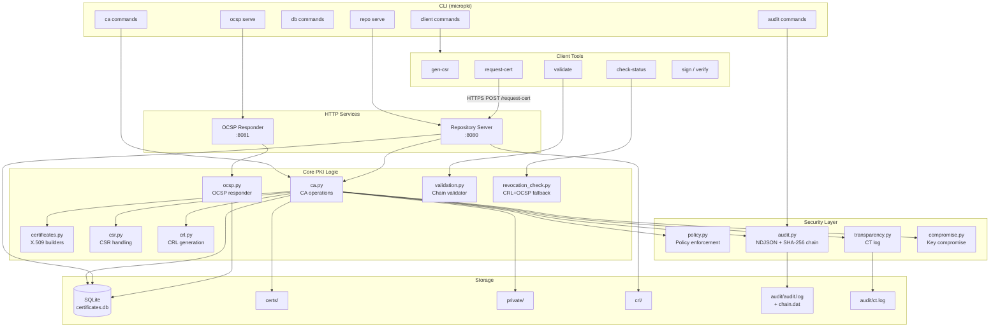

# MicroPKI Architecture

## Component Diagram

## Component Description
### CLI Layer
#### Single entry point micropki with command groups: ca, client, db, audit, repo, ocsp.

### Core PKI Logic
#### Implements RFC 5280 X.509 certificates, RFC 5280 CRL, RFC 6960 OCSP.

### Security Layer
* Policy — enforces key sizes, validity periods, SAN restrictions
* Audit — NDJSON log with SHA-256 hash chain for tamper detection
* Transparency — CT-log simulation (append-only public log)
* Compromise — blocks reuse of compromised public keys
### Storage
* SQLite — certificate metadata, CRL metadata, compromised keys
* Filesystem — PEM certificates, encrypted private keys, CRLs, audit logs
### HTTP Services
* Repository (port 8080) — public distribution + CSR signing endpoint
* OCSP Responder (port 8081) — real-time revocation status
### Client Tools
#### End-user tools for CSR generation, certificate validation, revocation checking, code signing.

## Data Flow Examples
### Certificate Issuance via API
1. Client generates key pair + CSR (client gen-csr)
2. Client sends CSR to repository (POST /request-cert)
3. Repository validates CSR (signature, policy)
4. Repository invokes ca.issue_certificate()
5. Certificate stored in DB + audit log + CT log
6. Certificate returned to client (PEM)
### Revocation Check (OCSP→CRL fallback)
1. Client requests status (client check-status)
2. Client extracts OCSP URL from cert's AIA extension
3. Client sends OCSP request
4. If OCSP succeeds → return result
5. If OCSP fails → fallback to CRL (from CDP or --crl)
6. CRL signature verified, serial searched in revocation list
### Audit Integrity
1. Every critical operation writes entry to audit.log
2. Entry includes SHA-256 hash linking to previous entry
3. chain.dat stores latest hash for fast verification
4. audit verify recomputes full chain and detects tampering